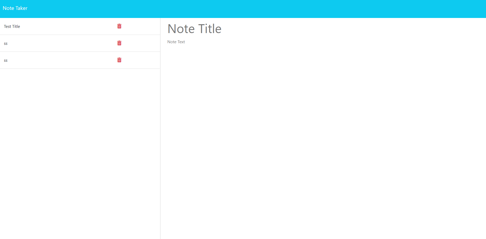

# Express.js-Note-Taker

Challenge 11: Express.js-Note-Taker

This is an application that can be used to write and save notes. The application uses Express.js back end and can save and retrieve note data from a JSON file.

Repo: https://github.com/hiltyalec/Express.js-Note-Taker

Deployed Application: https://express-note-taker-ah-ad72f4622ed0.herokuapp.com/
